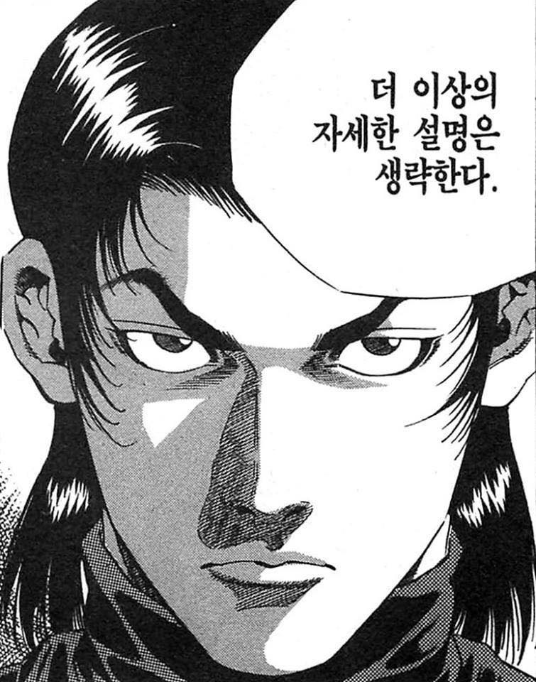

# 2R Tracker

[Reddit Bodyweight Fitness Community](https://www.reddit.com/r/bodyweightfitness/)의 ["권장 루틴"](https://www.reddit.com/r/bodyweightfitness/wiki/kb/recommended_routine) 수행을 도와주는 서비스.

## 중심 아이디어

1. 목표 설정 기능: 달성하고 싶은 세부 목표를 저장해둔다.
2. 상세 기록 기능: 일자별로 권장 루틴의 수행 내역과 메모를 기록한다.
3. 성취 점검 기능: 목표 대비 일자별 추이를 보여준다.
